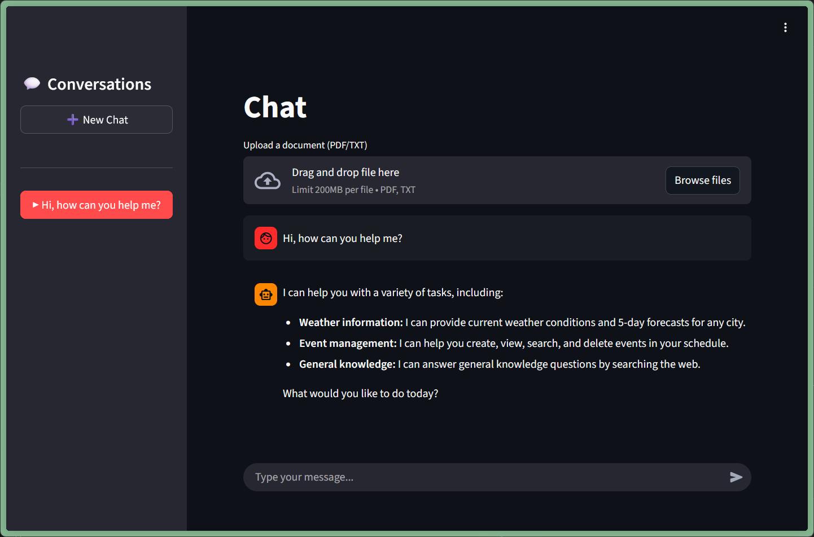

# Agentic AI Workflow Chatbot

An intelligent chatbot that uses AI agents to handle weather queries, document analysis, meeting scheduling, and natural language database queries. Built for a recruitment task, this demonstrates agentic AI reasoning with tool use.



## What This Does

This chatbot can:

- **🌤️ Weather Intelligence**: Get current weather or 5-day forecasts for any city
- **📄 Document QA + Web Search**: Upload PDFs/text files and ask questions. If the answer isn't in the document, it automatically searches the web
- **📅 Smart Meeting Scheduling**: Schedule meetings based on weather conditions (e.g., "schedule a team meeting tomorrow if the weather is good")
- **💬 Natural Language DB Queries**: Ask about your schedule in plain English ("Do I have any meetings tomorrow?")

## 🏗️ Architecture Decisions

### Why ReAct Agent (Not Router)?

I chose a **single ReAct agent** instead of a router-based architecture because:

- **Simpler is better**: The task doesn't need complex routing logic and having 4 separate agents is overkill
- **Better reasoning**: One agent can chain tools together (e.g., check weather → check schedule → create meeting)
- **More natural**: Conversations flow better without artificial boundaries between "agents"

### Why Let the LLM Judge Weather Quality?

Instead of hardcoding thresholds like "temp > 20°C = good weather," I let the LLM reason about weather quality because:

- Handles nuance: "Light drizzle with warm temps" vs "heavy rain"
- Context-aware: Different meetings need different conditions
- Explainable: The LLM explains WHY it thinks weather is good/bad

Since it's an language task, letting the LLM to decide is better than conditional programming.

## 🚀 Quick Start

### Prerequisites

- Python 3.8+
- PostgreSQL (running locally or remote)
- API Keys for:
  - [OpenRouter](https://openrouter.ai) (for LLM access)
  - [SerpAPI](https://serpapi.com) (for Google search)
  - [OpenWeatherMap](https://openweathermap.org/api) (for weather data)

### Installation

1. **Clone the repo**
   ```bash
   git clone https://github.com/sharunashwanth/mittai-agent.git
   cd mittai-agent
   ```

1. **Install dependencies**
   ```bash
   pip install -r requirements.txt
   ```

1. **Set up environment variables**
   ```bash
   cp .env.example .env
   ```

   Then edit `.env` with your API keys.

1. **Start the backend**
   ```bash
   cd app
   uvicorn app:app --port 8000
   ```

   Backend runs on `http://localhost:8000`

1. **Start the frontend** (in a new terminal)
   ```bash
   streamlit run streamlit_app.py
   ```

   Open your browser to `http://localhost:8501`


## 🛠️ Tech Stack

- **Backend**: FastAPI (async, streaming responses)
- **Frontend**: Streamlit (quick prototyping)
- **AI Framework**: LangChain (agent orchestration)
- **LLM**: OpenRouter (supports multiple models)
- **Database**: PostgreSQL + SQLAlchemy ORM
- **Tools**:
  - OpenWeatherMap API (weather data)
  - SerpAPI (Google search)
  - LangChain tools (custom tool definitions)


## Features

- **Streaming responses**: See the AI think in real-time with tool call indicators
- **Multi-conversation support**: Sidebar shows all your past chats
- **Document upload**: Drag-and-drop PDF/TXT files directly in the UI
- **Conversation persistence**: In-memory storage (survives within session)
- **Tool visibility**: See which tools the agent is using as it works

## Known Limitations (Prototype Scope)

This is a **2-day prototype** built to demonstrate core functionality. Here's what's intentionally simplified:

- In-memory conversation storage
- No tool retry mechanism
- No file size limit enforcement in backend (handled 200 MB limit by streamlit)
- Using SQLAlchemy ORM with parameterized queries (safe), but input sanitization could be stricter.

## 📸 Screenshots

See the `screenshots/` folder for demo images showing:
1. Initial chat interface
2. Document upload and QA
3. Meeting scheduling workflow

## 🙋 Questions?

This was built as a recruitment task. I'm happy to discuss any architectural decisions or explain my reasoning. The focus was on demonstrating **agentic AI capabilities** within a tight timeline.
